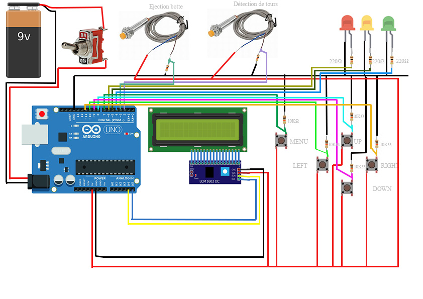

# Compteur de tours pour filmeuse de bottes de foin (Arduino UNO)

Ce projet Arduino a pour objectif de faciliter le processus d'enrubannage de bottes de foin en automatisant le comptage du nombre de tours de film plastique autour de chaque botte, et en comptabilisant le nombre total de bottes enrubannées. Le système affiche les informations sur un écran LCD, indique l'état du processus via des LEDs (vert, orange, rouge), et permet la configuration du nombre de tours souhaités par botte via un menu interactif accessible avec des boutons.

---

## 🔧 Composants nécessaires

| Composant                  | Quantité | Description                                                    |
| -------------------------- | -------- | -------------------------------------------------------------- |
| Arduino UNO                | 1        | Carte microcontrôleur principale                               |
| Écran LCD 1602 I2C         | 1        | Affichage du nombre de tours, de bottes, et des menus          |
| Capteur de proximité       | 2        | Un pour détecter les tours, l'autre pour l'éjection des bottes |
| LED                        | 3        | Vert, orange, rouge (indication d'état)                        |
| Résistances 220Ω           | 3        | Pour les LEDs                                                  |
| Boutons-poussoirs          | 5        | Menu, Haut, Bas, Gauche, Droite                                |
| Résistances 10kΩ           | 5        | Pull-down pour les boutons                                     |
| Interrupteur ON/OFF        | 1        | Pour activer/désactiver le système                             |
| Pile 9V + connecteur       | 1        | Alimentation du montage                                        |
| Fils de connexion + plaque | Divers   | Pour les connexions                                            |

---

## 🖼️ Schéma de câblage

Voici le schéma de montage du projet :

---

## ⚙️ Fonctionnalités du programme

Le code Arduino embarqué permet plusieurs fonctionnalités essentielles :

### ✅ Comptage de tours

- Un capteur détecte chaque passage de la botte, comptabilisant ainsi les tours.
- Le nombre de tours est affiché en temps réel sur l'écran LCD.

### ✅ Comptage de bottes

- Lorsqu'un capteur détecte l'éjection d'une botte, le système ajoute une botte au compteur global.
- Le nombre total de bottes filmées s’affiche sur l’écran.

### ✅ Configuration via menu interactif

- Accès au menu par le bouton `MENU`.
- Navigation avec les boutons `HAUT`, `BAS`, `GAUCHE`, `DROITE`.
- Permet de :
  - Modifier le nombre de tours nécessaires par botte.
  - Réinitialiser le compteur total de bottes.

### ✅ Indicateurs lumineux

- **Vert** : En cours de filmage.
- **Orange** : Filmage presque terminé (à N-1 tours).
- **Rouge** : Filmage terminé, prêt pour l'éjection.

### ✅ Gestion de batterie faible

- Si la tension d'alimentation chute sous un seuil critique, un message s'affiche sur le LCD :  
  ⚠ Batterie faible — Changer la pile
- Tant que la pile n’est pas changée, le système reste bloqué pour éviter un comportement imprévu.

---

## 💡 À venir

- Boîtier imprimé en 3D pour protéger le montage.
- Optimisation énergétique.
- Ajout d’un indicateur sonore (buzzer) optionnel.

---

## 📂 Organisation des fichiers

- `filmeuse_de_botte.ino` : Le code source Arduino.
- `filmeuse_de_botte.jpg` : Le schéma de câblage.
- `README.md` : Ce fichier de documentation.

---

## 🤝 Remerciements

Merci à la communauté Arduino pour les nombreuses ressources et partages. Ce projet a été réalisé dans le cadre d’un besoin personnel pour la mécanisation agricole, avec l’objectif de le partager en open-source.

---
